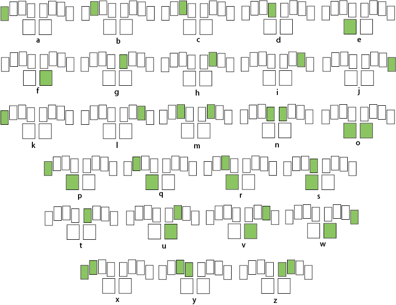

# MagicSpell

A new and exciting way to type on iOS tablets.
MagicSpell aims to assist children with dyslexia in improving their spelling skills by typing.

In a nutshell, it is a keyboard with only 10 input keys, allowing you to completely rest your hands on the keyboard with one finger on each key.

You must either use a single or a combination of keys to type a letter. The keys-to-letter mapping system is designed to promote fast learning for beginners.

INSTALLATION
---------

Prerequisite:
	iOS version 9.0 or higher

Download: MagicSpell will be released in the App Store

Installation steps:
- Go to Settings → General
- Go to Keyboard → Keyboards
- Click Add New Keyboard…
- Choose MagicSpell

Running:
  MagicSpell runs as a standalone keyboard so you can pop it up inside any application by holding down the globe key
  
RELEASE NOTES
---------
version  1.0.2

NEW FEATURES
- Added Shift key
- Added sound for each letter
- Added colors to keys and the option to change the color theme
- Added new buttons for special characters including comma, period, exclamation mark and question mark
	
BUG FIXES
- Fixed a bug that caused the program to crash when switching view
- Fixed a large amount of deprecated code due to Swift/iOS updates

KNOWN BUGS
- Color scheme is not being saved properly
- Sound does not work in iOS 10
  
LICENSE
---------
MIT licensed.
